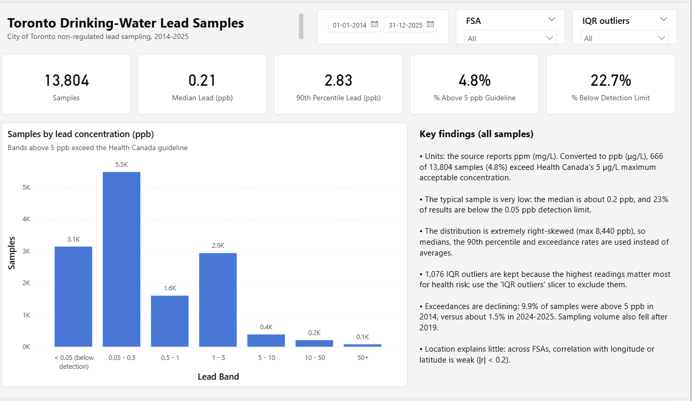
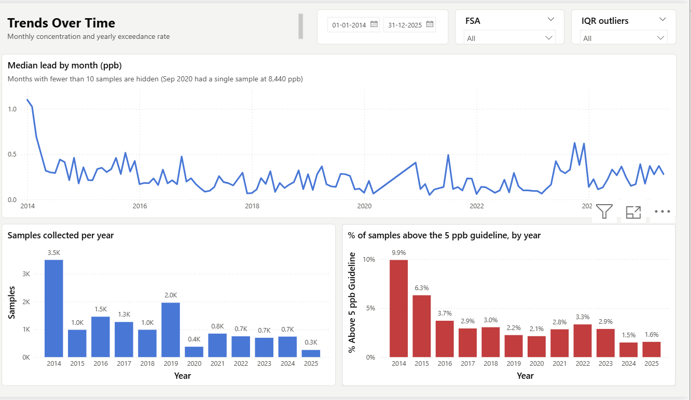
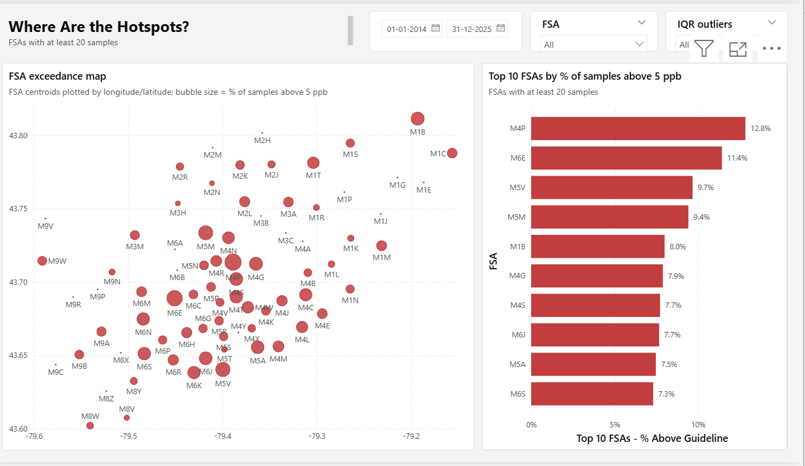
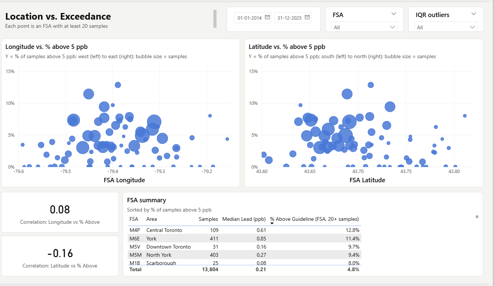

# Toronto Drinking-Water Lead Analysis (Power BI)

An interactive Power BI report on the City of Toronto's **non-regulated lead sampling program**:
13,804 residential tap-water samples collected between 2014 and 2025. It measures how often samples
exceed Canada's drinking-water guideline for lead, how that has changed over time, and which
neighbourhoods (FSAs) stand out.

**[Download the report (Toronto_Lead_Analysis.pbix)](Toronto_Lead_Analysis.pbix)**. The data is included, so it
opens ready to use in [Power BI Desktop](https://powerbi.microsoft.com/desktop/).



## Key findings

| | |
|---|---|
| **4.8% of samples exceed 5 ppb** | 666 of 13,804 samples are above Health Canada's maximum acceptable concentration of 5 µg/L (ppb). |
| **Typical exposure is very low** | The median is 0.21 ppb, and 22.7% of results are below the laboratory detection limit. |
| **Exceedances are declining** | 9.9% of samples exceeded 5 ppb in 2014, compared with about 1.5% in 2024–2025. |
| **Hotspots are local** | Among FSAs with 20 or more samples, M4P, M6E, M5V and M5M have the highest exceedance rates (9–13%). |
| **Location alone explains little** | Across FSAs, the correlation between exceedance rate and longitude (r = 0.08) or latitude (r = −0.16) is weak. |

## Report pages

| Page | What it shows |
|---|---|
| **Overview** | KPI cards (samples, median, 90th percentile, % above guideline, % below detection) and the distribution of results across concentration bands |
| **Trends** | Monthly median lead (months with 10 or more samples), samples per year, and % above the guideline per year |
| **Geography** | FSA bubble map (bubble size = exceedance rate) and the top 10 FSAs by % of samples above 5 ppb |
| **FSA Analysis** | Exceedance vs. longitude/latitude with trend lines, Pearson correlations, and an FSA summary table |

Every page has synced slicers for **sample date**, **FSA**, and **IQR outlier status**.

| Trends | Geography |
|---|---|
|  |  |



## Data preparation

Three properties of the raw data needed care:

1. **Units.** The source column is `Lead Amount (ppm)`. Values are converted to ppb (× 1,000) so they can be
   compared directly with the 5 ppb guideline.
2. **Below-detection results.** 3,136 results are reported as text (`<0.00005`). Rather than being dropped,
   they are kept, flagged, and set to half the detection limit.
3. **Extreme values.** 1,076 results sit above the usual IQR outlier threshold. They are kept, because the
   highest readings matter most for health risk, and flagged, so the *IQR outliers* slicer can exclude
   them for comparison.

FSA locations come from a static GeoNames centroid table, so the report refreshes offline.

## Data model

```
Lead Samples (fact, 13,804 rows) ──► Date (calculated calendar)
             └──────────────────────► FSA Lookup (FSA centroids, area and neighbourhood names)
```

- **Power Query** cleans the raw CSV: it renames columns, upper-cases FSAs, parses below-detection results,
  converts ppm to ppb, and adds concentration bands, the guideline flag and the IQR outlier flag.
- **DAX measures** cover sample counts, median, 90th percentile, % above guideline, % below detection,
  top-10 FSA ranking (dynamic with slicers), and FSA-level Pearson correlations.

## Built with

- **Power BI Desktop**: report design and interactivity
- **Power Query (M)**: data cleaning and transformation
- **DAX**: measures, dynamic ranking and correlations
- **Python**: rebuilding the FSA lookup table from GeoNames

## Repository contents

```
├── Toronto_Lead_Analysis.pbix        ← the Power BI report (data included)
├── data/
│   ├── Non Regulated Lead Samples.csv    ← source data (City of Toronto)
│   └── fsa_lookup.csv                    ← FSA centroids and neighbourhood names (GeoNames)
├── scripts/build_fsa_lookup.py       ← regenerates fsa_lookup.csv
└── images/                           ← report screenshots
```

## Refreshing the data

The report opens with its data already loaded, so you only need this to reload the CSVs, for example after
downloading a newer extract from Open Data Toronto:

1. Clone the repo (or download it as a ZIP and extract it).
2. In Power BI Desktop, go to **Transform data → Edit parameters** and set `DataFolder` to the full path of
   the `data` folder, for example `C:\...\toronto-lead-analysis-powerbi\data`.
3. Click **Refresh**.

## Data sources

- City of Toronto (2024). *Non-Regulated Lead Sample*. Open Data Toronto, Open Government Licence – Toronto.
  https://open.toronto.ca/dataset/non-regulated-lead-sample/
- GeoNames postal-code data for Canada (CC BY 4.0). https://download.geonames.org/export/zip/
- Health Canada (2019). *Guidelines for Canadian Drinking Water Quality: Lead* (MAC = 5 µg/L).
  https://www.canada.ca/en/health-canada/services/publications/healthy-living/guidelines-canadian-drinking-water-quality-guideline-technical-document-lead.html
